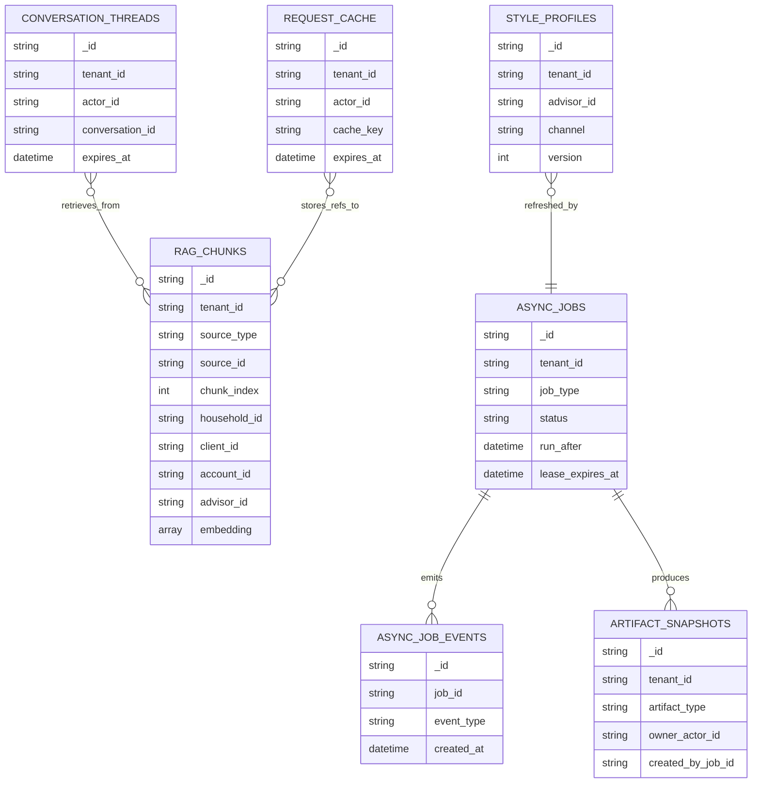
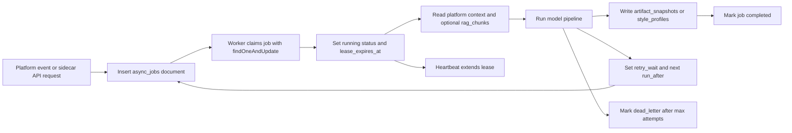
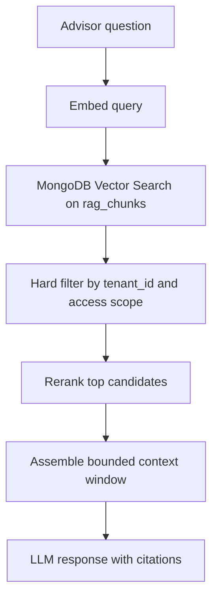

# Sidecar MongoDB-Only Design

## Overview

This document defines a MongoDB-only storage model for the Python sidecar.

The intent is to avoid operating both `pgvector` and Redis in the sidecar. Under this design:

- MongoDB stores embeddings and retrieval metadata
- MongoDB stores short-lived conversation state
- MongoDB stores async job documents and worker leases
- MongoDB stores transient AI artifacts such as digests, style profiles, and cached summaries

This is a sidecar-only design note. It does not change the existing specs in `specs/`, and it does not imply that the current `apps/intelligence-layer` code already matches this design.

## Decision

If the goal is operational simplicity, a Mongo-only sidecar is reasonable.

The clean split is:

- Go API server: MongoDB for platform operational aggregates
- Python sidecar: MongoDB for AI retrieval, transient memory, async job coordination, and non-authoritative AI artifacts
- Platform remains the source of truth for identity, permissions, workflows, durable records, and external execution

Recommended database boundary if both services share one cluster:

- `platform_api` database for API-server collections
- `sidecar_ai` database for sidecar collections

Do not mix sidecar collections into the API server's operational collections just because both use MongoDB.

## Why This Can Work

MongoDB can cover the three capabilities that were previously split across two systems:

- vector search over chunk embeddings
- expiration of transient documents
- event-driven or poll-based worker coordination

That means the sidecar can use one data platform if you accept the tradeoff that queueing, cache patterns, and vector retrieval all become Mongo-shaped instead of Redis-shaped or SQL-shaped.

## Non-Goals

This design does not move platform truth into the sidecar.

The sidecar still should not own:

- tenant identity
- entitlements or access policy decisions
- workflow advancement
- ledger or balance truth
- report publication records
- CRM or mailbox system-of-record writes

## Recommended Collection Catalog

| Collection | Purpose | Retention |
|---|---|---|
| `rag_chunks` | Vectorized retrieval chunks for documents, emails, notes, transcripts, and activities | Long-lived until source is deleted or reindexed |
| `conversation_threads` | Short-lived multi-turn message history and active entity context | TTL |
| `async_jobs` | Worker queue, retries, lease state, and job result summary | TTL after terminal state |
| `async_job_events` | Append-only lifecycle events for jobs | TTL or archive |
| `artifact_snapshots` | Daily digests, meeting summaries, firm-report intermediates, and other non-authoritative AI outputs | TTL or versioned retention by artifact type |
| `style_profiles` | Advisor writing-style summaries and refresh metadata | Long-lived with versioning |
| `request_cache` | Short-lived enriched reads and expensive intermediate results | TTL |

## Core Schemas

### `rag_chunks`

Purpose:

- hold chunk text, embedding vectors, and scope metadata in one document
- support tenant-scoped retrieval with MongoDB Vector Search plus metadata filters

Recommended document shape:

```json
{
  "_id": "rag_01JZ4M7J5B8K6V2R9A",
  "tenant_id": "tenant_123",
  "source_type": "document",
  "source_id": "doc_456",
  "chunk_index": 0,
  "household_id": "hh_12",
  "client_id": "client_9",
  "account_id": null,
  "advisor_id": "adv_7",
  "visibility_tags": ["document", "tax", "client:client_9"],
  "title": "2025 Tax Return",
  "author": "platform-upload",
  "text": "Chunk text goes here",
  "embedding": [0.012, -0.034, 0.009],
  "created_at": "2026-03-28T14:10:00Z",
  "updated_at": "2026-03-28T14:10:00Z",
  "metadata": {
    "file_type": "pdf",
    "page": 1,
    "document_version_id": "docv_123"
  }
}
```

Indexes:

- unique `{ tenant_id: 1, source_id: 1, chunk_index: 1 }`
- `{ tenant_id: 1, source_type: 1, source_id: 1 }`
- `{ tenant_id: 1, household_id: 1, updated_at: -1 }`
- `{ tenant_id: 1, client_id: 1, updated_at: -1 }`
- `{ tenant_id: 1, account_id: 1, updated_at: -1 }`
- `{ tenant_id: 1, advisor_id: 1, updated_at: -1 }`
- multikey `{ tenant_id: 1, visibility_tags: 1 }` only if tag filters are common
- MongoDB Vector Search index on `embedding`

Notes:

- every retrieval query must hard-filter by `tenant_id`
- use metadata filters for `household_id`, `client_id`, `account_id`, `advisor_id`, and `visibility_tags`
- reindexing should delete and replace all chunks for `{ tenant_id, source_id }`

### `conversation_threads`

Purpose:

- replace Redis chat memory with a TTL-backed Mongo collection
- preserve structured tool-call history and active entity context per conversation

Recommended document shape:

```json
{
  "_id": "conv_01JZ4M9A8T2W4H3P1Q",
  "tenant_id": "tenant_123",
  "actor_id": "advisor_42",
  "conversation_id": "conv_ui_20260328_001",
  "active_household_id": "hh_12",
  "active_client_id": "client_9",
  "message_count": 14,
  "messages": [
    {
      "kind": "request",
      "parts": [{"part_kind": "user-prompt", "content": "Summarize Smith family notes"}],
      "created_at": "2026-03-28T14:20:00Z"
    }
  ],
  "last_message_at": "2026-03-28T14:20:00Z",
  "expires_at": "2026-03-28T16:20:00Z",
  "created_at": "2026-03-28T14:20:00Z",
  "updated_at": "2026-03-28T14:20:00Z"
}
```

Indexes:

- unique `{ tenant_id: 1, actor_id: 1, conversation_id: 1 }`
- `{ tenant_id: 1, actor_id: 1, updated_at: -1 }`
- TTL on `expires_at`

Notes:

- keep a dedicated `expires_at` field because TTL indexes are single-field
- trim message history before save so documents do not grow without bound
- scope by both `tenant_id` and `actor_id`; never share conversation documents across advisors unless explicitly intended

### `async_jobs`

Purpose:

- replace Redis plus ARQ with a Mongo-backed leased job queue
- keep retry state, scheduling, and worker ownership in durable documents

Recommended document shape:

```json
{
  "_id": "job_01JZ4MC8N1R7E5Y6D0",
  "tenant_id": "tenant_123",
  "job_type": "daily_digest",
  "status": "queued",
  "priority": 50,
  "run_after": "2026-03-29T11:00:00Z",
  "lease_expires_at": null,
  "worker_id": null,
  "attempt": 0,
  "max_attempts": 3,
  "dedupe_key": "daily_digest:tenant_123:advisor_42:2026-03-29",
  "payload": {
    "advisor_id": "advisor_42",
    "artifact_date": "2026-03-29"
  },
  "result_summary": null,
  "last_error": null,
  "created_at": "2026-03-28T14:30:00Z",
  "started_at": null,
  "finished_at": null,
  "expires_at": "2026-04-05T14:30:00Z"
}
```

Recommended status values:

- `queued`
- `running`
- `retry_wait`
- `completed`
- `failed`
- `dead_letter`
- `cancelled`

Indexes:

- `{ status: 1, run_after: 1, priority: -1 }`
- `{ status: 1, lease_expires_at: 1 }`
- `{ tenant_id: 1, job_type: 1, created_at: -1 }`
- partial unique `{ tenant_id: 1, job_type: 1, dedupe_key: 1 }` for active jobs where `status` is in `["queued", "running", "retry_wait"]`
- TTL on `expires_at`

Notes:

- `dedupe_key` prevents duplicate digests, transcription runs, or reindex jobs for the same logical unit of work
- keep terminal jobs briefly for visibility, then expire them with TTL
- do not embed a full append-only event log in the job document; use `async_job_events`

### `async_job_events`

Purpose:

- append-only operational history for jobs
- makes retries and dead-letter diagnosis readable without mutating prior state

Recommended document shape:

```json
{
  "_id": "jeve_01JZ4MDF6Z8Y2S3L4X",
  "job_id": "job_01JZ4MC8N1R7E5Y6D0",
  "tenant_id": "tenant_123",
  "event_type": "lease_claimed",
  "worker_id": "worker-a-3",
  "attempt": 1,
  "payload": {
    "lease_expires_at": "2026-03-29T11:10:00Z"
  },
  "created_at": "2026-03-29T11:00:02Z",
  "expires_at": "2026-04-28T11:00:02Z"
}
```

Indexes:

- `{ job_id: 1, created_at: 1 }`
- `{ tenant_id: 1, event_type: 1, created_at: -1 }`
- TTL on `expires_at` if you do not archive these elsewhere

### `artifact_snapshots`

Purpose:

- store non-authoritative outputs generated by the sidecar
- make async jobs queryable without writing into platform source-of-truth collections

Recommended artifact types:

- `daily_digest`
- `meeting_summary`
- `firm_report_intermediate`
- `email_triage_result`
- `transcript_summary`

Recommended document shape:

```json
{
  "_id": "art_01JZ4MFXQ4K7N8P9R1",
  "tenant_id": "tenant_123",
  "artifact_type": "daily_digest",
  "owner_actor_id": "advisor_42",
  "source_refs": [
    {"source_type": "email", "source_id": "email_100"},
    {"source_type": "task", "source_id": "task_555"}
  ],
  "payload": {
    "summary": "Three important items today...",
    "items": []
  },
  "freshness": {
    "as_of": "2026-03-29T10:55:00Z",
    "source_window_start": "2026-03-28T00:00:00Z"
  },
  "created_by_job_id": "job_01JZ4MC8N1R7E5Y6D0",
  "created_at": "2026-03-29T11:00:30Z",
  "expires_at": "2026-03-30T11:00:30Z"
}
```

Indexes:

- `{ tenant_id: 1, artifact_type: 1, owner_actor_id: 1, created_at: -1 }`
- `{ tenant_id: 1, created_by_job_id: 1 }`
- TTL on `expires_at` for short-lived artifacts

### `style_profiles`

Purpose:

- persist advisor writing-style features so email drafting does not relearn them on every request

Recommended document shape:

```json
{
  "_id": "style_01JZ4MH4Q7M6A2N5S9",
  "tenant_id": "tenant_123",
  "advisor_id": "advisor_42",
  "channel": "email",
  "version": 3,
  "profile": {
    "tone": "warm and concise",
    "signature_pattern": "Best,\\nAlex",
    "common_phrases": ["happy to help", "let me know a time that works"]
  },
  "sample_window": {
    "message_count": 200,
    "start_at": "2026-01-01T00:00:00Z",
    "end_at": "2026-03-28T00:00:00Z"
  },
  "last_refreshed_at": "2026-03-28T07:00:00Z",
  "created_by_job_id": "job_01JZ4MSTYLE",
  "created_at": "2026-03-28T07:00:00Z",
  "updated_at": "2026-03-28T07:00:00Z"
}
```

Indexes:

- unique `{ tenant_id: 1, advisor_id: 1, channel: 1, version: 1 }`
- partial unique `{ tenant_id: 1, advisor_id: 1, channel: 1, is_current: 1 }` if current-version semantics are used

### `request_cache`

Purpose:

- replace Redis cache entries with TTL-backed Mongo documents
- hold enriched reads, expensive prompt inputs, or reranked retrieval results that are safe to reuse briefly

Recommended document shape:

```json
{
  "_id": "cache_01JZ4MJ7F3Q2L6D8V1",
  "tenant_id": "tenant_123",
  "actor_id": "advisor_42",
  "cache_key": "retrieval:smith-roth-conversion:3b1a...",
  "cache_scope": "advisor",
  "payload": {
    "chunk_ids": ["rag_1", "rag_2"]
  },
  "created_at": "2026-03-28T14:40:00Z",
  "expires_at": "2026-03-28T14:45:00Z"
}
```

Indexes:

- unique `{ tenant_id: 1, actor_id: 1, cache_key: 1 }`
- TTL on `expires_at`

Notes:

- use short TTLs only
- never share advisor-scoped cache documents across tenants

## Worker Coordination Model

MongoDB replaces the Redis queue with a lease-based claim model.

Recommended flow:

1. API process or scheduler inserts an `async_jobs` document with `status = "queued"`.
2. Worker polls for claimable work or listens to a change stream for faster wakeups.
3. Worker claims one job with atomic `findOneAndUpdate`.
4. Worker sets `status = "running"`, `worker_id`, `started_at`, and `lease_expires_at`.
5. Worker periodically heartbeats by extending `lease_expires_at`.
6. On success, worker writes any artifact documents and marks the job `completed`.
7. On failure, worker either moves the job to `retry_wait` with a new `run_after`, or to `dead_letter` when attempts are exhausted.

Recommended claim filter:

```javascript
{
  status: { $in: ["queued", "retry_wait"] },
  run_after: { $lte: now },
  $or: [
    { lease_expires_at: null },
    { lease_expires_at: { $lt: now } }
  ]
}
```

Recommended claim update:

```javascript
{
  $set: {
    status: "running",
    worker_id: workerId,
    started_at: now,
    lease_expires_at: leaseUntil
  },
  $inc: {
    attempt: 1
  }
}
```

Notes:

- use `sort` by `priority` descending and `run_after` ascending during claim
- use short lease windows and heartbeat extension so abandoned jobs can be reclaimed
- use change streams only as an optimization; polling remains the correctness path

## Retrieval Model

`rag_chunks` becomes the only retrieval store.

Recommended search behavior:

- query embedding generated by the sidecar
- vector search on `embedding`
- hard filter on `tenant_id`
- additional filters on `household_id`, `client_id`, `account_id`, `advisor_id`, and `visibility_tags`
- rerank top candidates in application code if needed

Representative aggregation shape:

```javascript
[
  {
    $vectorSearch: {
      index: "rag_chunks_vector",
      path: "embedding",
      queryVector: queryEmbedding,
      numCandidates: 200,
      limit: 20,
      filter: {
        tenant_id: tenantId,
        $or: [
          { household_id: { $in: allowedHouseholdIds } },
          { client_id: { $in: allowedClientIds } },
          { advisor_id: { $in: allowedAdvisorIds } },
          { account_id: { $in: allowedAccountIds } },
          {
            household_id: null,
            client_id: null,
            advisor_id: null,
            account_id: null
          }
        ]
      }
    }
  },
  {
    $project: {
      source_type: 1,
      source_id: 1,
      text: 1,
      household_id: 1,
      client_id: 1,
      account_id: 1,
      advisor_id: 1,
      metadata: 1,
      score: { $meta: "vectorSearchScore" }
    }
  }
]
```

Rules:

- `tenant_id` must never be applied after retrieval; it has to be part of the search filter
- retrieval must stay actor-scoped before any chunk reaches the LLM
- use source deletion and reindex jobs to keep `rag_chunks` clean rather than soft-hiding stale chunks forever

## TTL And Retention Rules

Use dedicated `expires_at` fields for transient collections because MongoDB TTL indexes are single-field.

Recommended TTL usage:

- `conversation_threads.expires_at`
- `async_jobs.expires_at`
- `async_job_events.expires_at`
- `artifact_snapshots.expires_at`
- `request_cache.expires_at`

Recommended non-TTL collections:

- `rag_chunks`
- `style_profiles`

For long-lived collections, use explicit deletes or versioning, not TTL.

## Mermaid Diagrams

### Data Model



### Async Job Lifecycle



### Retrieval Flow



## Operating Rules

- keep sidecar collections in a separate database or naming boundary from platform collections
- keep `tenant_id` on every sidecar document that is tenant-scoped
- avoid storing authoritative workflow state in `artifact_snapshots`
- treat `async_job_events` as append-only
- prefer recomputation or short TTL over long-lived cache documents
- use the same source IDs the platform uses so citations and artifact references stay stable

## Risks And Tradeoffs

This design simplifies infrastructure, but it is not free.

What gets simpler:

- one sidecar data platform instead of two
- no sync boundary between vector data and sidecar metadata
- one operational model for TTL, backups, and tenant isolation

What gets harder:

- you lose Redis-native queue semantics and have to own lease logic
- worker throughput depends on good indexes and careful polling behavior
- vector retrieval tuning becomes Mongo-specific rather than `pgvector`-specific

## Implementation Note

The current `apps/intelligence-layer` codebase still assumes Redis plus a separate vector store abstraction. This document is a target architecture note for a Mongo-only sidecar, not a claim that the implementation already uses it.
