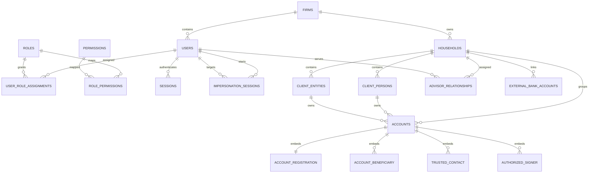
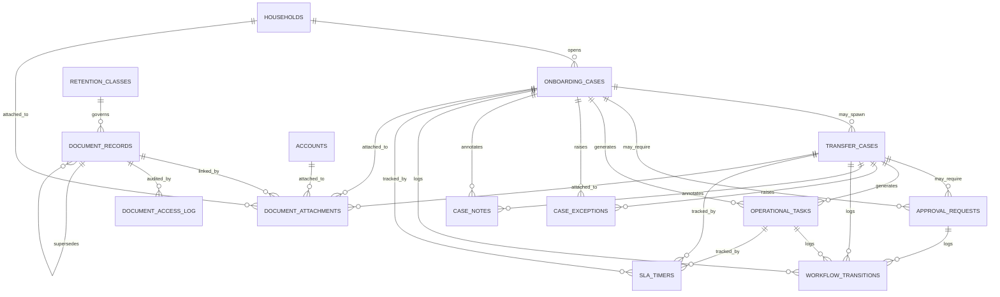
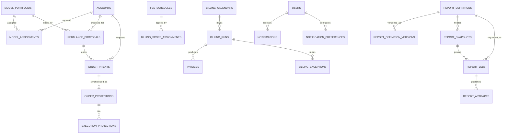

# API Server Go Data Model (MongoDB)

## 1. Purpose

This document holds the detailed MongoDB data model for the Go API server variant.

It is intentionally separate from [specs/api-server-go.md](/Users/eswar/Desktop/wealth-advisor/specs/api-server-go.md) so the main API spec stays focused on responsibilities, request flow, auth, and API behavior.

This document covers:

- MongoDB aggregate design rules
- collection catalog and ownership boundaries
- collection-level schema guidance
- index guidance
- Mermaid data diagrams

## 2. Service Boundaries

This doc is only for the Go API server's MongoDB-backed operational model.

The Python sidecar is a separate concern and can use a different storage stack.

That split is acceptable:

- Go API server: MongoDB for platform-owned operational aggregates, projections, document metadata, workflow state, and audit
- Python sidecar: `pgvector` for retrieval embeddings and Redis for cache, rate/cost counters, transient memory, and job coordination

Do not force sidecar vector data into the API server's MongoDB model just for uniformity. The data shapes and query patterns are different.

## 3. MongoDB Conventions

### 3.1 Aggregate rules

- map one collection to one aggregate root
- do not transliterate every relational child table into its own collection
- embed bounded child arrays when the child data is read with the parent and shares the parent's lifecycle
- split child state into separate collections when it is append-only, independently queried, many-to-many, or expected to grow without a tight bound
- treat regulated workflow history as append-only data

### 3.2 Identity and tenancy

- every tenant-scoped document must include `tenant_id`
- use application-assigned UUID strings for business-resource `_id` values
- keep IDs stable across HTTP APIs, Kafka events, workers, and external services

Recommended base document:

```go
type BaseDocument struct {
    ID        string    `bson:"_id" json:"id"` // UUID
    TenantID  string    `bson:"tenant_id" json:"tenant_id"`
    CreatedAt time.Time `bson:"created_at" json:"created_at"`
    UpdatedAt time.Time `bson:"updated_at" json:"updated_at"`
    Version   int64     `bson:"version" json:"version"`
}
```

### 3.3 Mutability rules

- use `version` for optimistic concurrency on mutable aggregates
- prefer soft deletion or terminal status fields over destructive delete
- use fields such as `revoked_at`, `ended_at`, `archived_at`, `closed_at`, or `is_current_version`
- keep workflow and audit history immutable

### 3.4 Security rules

- encrypt sensitive-at-rest fields such as `ssn`, `tin`, bank account numbers, and MFA secrets before persistence
- also persist masked or last-four derivatives for read paths
- never expose encrypted fields directly in API presenters

### 3.5 Index rules

- every tenant-scoped collection should start with `{tenant_id: 1, ...}`
- use unique compound indexes for idempotency keys
- use TTL indexes for sessions, refresh tokens, caches, and dead-letter documents
- use partial indexes for common active-status paths
- use multikey indexes sparingly on embedded arrays

## 4. Collection Catalog

The API server is authoritative for:

- `firms`
- `users`, `invitations`, `roles`, `permissions`, `role_permissions`, `user_role_assignments`
- `sessions`, `refresh_tokens`, `mfa_factors`, `mfa_recovery_codes`, `service_accounts`, `impersonation_sessions`
- `households`, `client_persons`, `client_entities`, `advisor_relationships`
- `accounts`, `account_status_transitions`, `external_bank_accounts`
- `onboarding_cases`, `transfer_cases`, `approval_policies`, `approval_requests`, `operational_tasks`
- `case_exceptions`, `case_notes`, `workflow_transitions`, `sla_policies`, `sla_timers`
- `document_records`, `retention_classes`, `document_attachments`, `document_access_log`
- `model_portfolios`, `marketplace_models`, `marketplace_subscriptions`, `model_assignments`, `rebalance_rules`, `rebalance_proposals`
- `order_intents`, `order_projections`, `execution_projections`
- `fee_schedules`, `billing_scope_assignments`, `billing_calendars`, `billing_runs`, `invoices`, `billing_exceptions`
- `report_definitions`, `report_definition_versions`, `report_snapshots`, `report_jobs`, `report_artifacts`
- `notifications`, `notification_preferences`
- `audit_events`

The API server is not authoritative for:

- security definitions
- order routing state
- execution fills
- external money movement rail status

Local synchronized projections should carry:

```go
type SyncMetadata struct {
    UpstreamSource string    `bson:"upstream_source"`
    UpstreamID     string    `bson:"upstream_id"`
    LastSyncedAt   time.Time `bson:"last_synced_at"`
    SyncStatus     string    `bson:"sync_status"` // "synced", "stale", "failed"
}
```

## 5. Aggregate Strategy

The broader architecture docs prefer Postgres for the operational core. This document is the Mongo-backed edition of the platform. If this edition is chosen, the collection model must be intentional and cannot be a one-for-one SQL table port.

Preferred rules:

- use explicit collection names such as `client_persons`, `document_records`, and `order_intents`
- avoid ambiguous buckets such as `clients` or `documents`
- embed child state when cardinality is bounded and the dominant read path needs the full parent aggregate
- separate child state when it is append-only, independently queried, many-to-many, or expected to grow without a tight bound
- keep write-side aggregates immutable by history rather than destructive overwrite for regulated workflows
- store upstream projections with `sync_metadata` and `upstream_event_timestamp` so replay safety is visible in the data model

Recommended mapping:

| Aggregate root | Primary collection | Embed in primary document | Keep as separate collections |
|---|---|---|---|
| Firm | `firms` | `branding`, `settings` | `audit_events` |
| User/Auth | `users` | `profile`, `active_role_names` | `invitations`, `user_role_assignments`, `sessions`, `refresh_tokens`, `mfa_factors`, `mfa_recovery_codes`, `service_accounts`, `impersonation_sessions` |
| Household | `households` | `service_team`, lightweight summary state | `advisor_relationships`, `household_dashboard_views` |
| Client entity | `client_entities` | `roles[]` | none |
| Account | `accounts` | `registration`, `beneficiaries[]`, `trusted_contacts[]`, `authorized_signers[]` | `account_status_transitions`, `external_bank_accounts` |
| Onboarding case | `onboarding_cases` | `party_refs[]`, `account_refs[]`, `disclosure_acceptances[]`, `checklist`, `client_action_requests[]` | `approval_requests`, `case_exceptions`, `case_notes`, `workflow_transitions`, `sla_timers` |
| Transfer case | `transfer_cases` | `rail_details`, `funding_details`, `settlement_summary` | `approval_requests`, `case_exceptions`, `case_notes`, `workflow_transitions`, `sla_timers` |
| Document record | `document_records` | `metadata`, `versioning`, `sensitivity`, signer/source refs | `retention_classes`, `document_attachments`, `document_access_log` |
| Model portfolio | `model_portfolios` | `allocations[]` | `model_assignments`, `rebalance_rules`, `marketplace_subscriptions` |
| Rebalance proposal | `rebalance_proposals` | `assumptions`, `trades[]`, `released_order_intent_ids[]` | `order_intents` |
| Billing run | `billing_runs` | `schedule_snapshot`, `summary` | `invoices`, `billing_exceptions` |
| Invoice | `invoices` | `line_items[]` | none |
| Report definition | `report_definitions` | `sections[]`, `client_scope` | `report_definition_versions`, `report_snapshots`, `report_jobs`, `report_artifacts` |
| Notification | `notifications` | action payload | `notification_preferences` |

## 6. Collection Schemas

Embedded arrays shown here are logical child entities and do not necessarily require their own collections.

### 6.1 Tenant, identity, and access

`firms`

- Fields: `_id`, `slug`, `name`, `status`, `branding`, `settings`, `created_at`, `updated_at`, `version`
- Indexes: unique `{ slug: 1 }`, `{ status: 1, slug: 1 }`, `{ updated_at: -1 }`
- Notes: `branding` should carry logo URL, colors, firm name variants, and client-portal presentation settings; `settings` should carry MFA policy, rate-limit overrides, and tenant-level notification/email toggles

`users`

- Fields: `_id`, `tenant_id`, `email`, `password_hash`, `display_name`, `status`, `active_role_names`, `profile`, `last_login_at`, `created_at`, `updated_at`, `version`
- Indexes: unique `{ tenant_id: 1, email: 1 }`, `{ tenant_id: 1, status: 1, display_name: 1 }`
- Notes: `active_role_names` is a denormalized auth cache only; role history remains authoritative in `user_role_assignments`

`user_role_assignments`

- Fields: `_id`, `tenant_id`, `user_id`, `role_name`, `assigned_by`, `assigned_at`, `revoked_at`
- Indexes: `{ tenant_id: 1, user_id: 1, revoked_at: 1 }`, partial unique `{ tenant_id: 1, user_id: 1, role_name: 1 }` where `revoked_at` is null
- Notes: soft-revoke instead of overwrite so role history and audit remain intact

`sessions`

- Fields: `_id`, `tenant_id`, `user_id`, `actor_type`, `mfa_verified`, `ip_address`, `user_agent`, `created_at`, `last_active_at`, `expires_at`, `revoked_at`
- Indexes: `{ tenant_id: 1, user_id: 1, revoked_at: 1 }`, `{ tenant_id: 1, created_at: -1 }`, TTL on `expires_at`
- Notes: `actor_type` distinguishes user, service, and impersonation sessions; Redis still handles short-lived revocation propagation

`impersonation_sessions`

- Fields: `_id`, `tenant_id`, `support_user_id`, `target_user_id`, `reason`, `approval_reference`, `status`, `started_at`, `ended_at`, `expires_at`, `idempotency_key`
- Indexes: unique `{ tenant_id: 1, idempotency_key: 1 }`, `{ tenant_id: 1, support_user_id: 1, started_at: -1 }`, `{ tenant_id: 1, target_user_id: 1, started_at: -1 }`, TTL on `expires_at`
- Notes: store both the true support actor and impersonated actor chain; impersonation actions should also carry `impersonation_session_id` in audit metadata

Supporting identity/access collections:

| Collection | Key fields | Notes / indexes |
|---|---|---|
| `invitations` | `tenant_id`, `email`, `role_name`, `token_hash`, `expires_at`, `status`, `invited_by` | Unique pending invite per `{ tenant_id, email, status }`; TTL on `expires_at` if expired invites are not retained |
| `refresh_tokens` | `tenant_id`, `user_id`, `session_id`, `token_hash`, `expires_at`, `revoked_at` | Unique token hash; TTL on `expires_at`; index `{ tenant_id, session_id, revoked_at }` |
| `mfa_factors` | `tenant_id`, `user_id`, `type`, `secret_encrypted`, `verified_at` | One active TOTP factor per user |
| `mfa_recovery_codes` | `tenant_id`, `user_id`, `code_hash`, `used_at` | Query by user and unused status |
| `roles` | `_id`, `name`, `description`, `is_system` | Usually small, platform-seeded collection |
| `permissions` | `_id`, `name`, `description` | Usually small, platform-seeded collection |
| `role_permissions` | `role_name`, `permission_name` | Small mapping collection; cache aggressively |
| `service_accounts` | `tenant_id` nullable, `name`, `key_hash`, `permissions[]`, `status`, `created_at`, `rotated_at` | Global services may use platform scope rather than a single tenant |

### 6.2 Household, client, and account registry

`households`

- Fields: `_id`, `tenant_id`, `name`, `status`, `primary_advisor_id`, `service_team`, `notes`, `created_by`, `created_at`, `updated_at`, `version`
- Indexes: `{ tenant_id: 1, status: 1, primary_advisor_id: 1, _id: 1 }`, `{ tenant_id: 1, name: 1 }`
- Notes: keep only household-owned summary state here; do not duplicate full client or account records inside the household document

`client_persons`

- Fields: `_id`, `tenant_id`, `household_id`, `first_name`, `middle_name`, `last_name`, `suffix`, `date_of_birth`, `ssn_encrypted`, `ssn_last_four`, `citizenship_country`, `residency_country`, `tax_id_type`, `email`, `phone_primary`, `phone_secondary`, `mailing_address`, `residential_address`, `employment_status`, `employer_name`, `occupation`, `is_control_person`, `is_politically_exposed`, `regulatory_disclosures`, `status`, `created_by`, `created_at`, `updated_at`, `version`
- Indexes: `{ tenant_id: 1, household_id: 1, status: 1, last_name: 1, first_name: 1 }`, text or normalized-search index across display name/email fields, sparse `{ tenant_id: 1, ssn_last_four: 1 }`
- Notes: encrypted fields are never exposed directly; store masked derivatives for UI and ops workflows

`client_entities`

- Fields: `_id`, `tenant_id`, `household_id`, `entity_type`, `legal_name`, `dba_name`, `tin_encrypted`, `tin_last_four`, `formation_date`, `formation_state`, `formation_country`, `tax_classification`, `mailing_address`, `principal_address`, `governing_document_type`, `status`, `roles[]`, `created_by`, `created_at`, `updated_at`, `version`
- Embedded `roles[]` fields: `client_person_id`, `role`, `status`, `added_at`, `removed_at`
- Indexes: `{ tenant_id: 1, household_id: 1, entity_type: 1, status: 1 }`, `{ tenant_id: 1, legal_name: 1 }`, sparse multikey `{ tenant_id: 1, "roles.client_person_id": 1 }`
- Notes: embedding roles is appropriate because role counts are low and the dominant read path is entity detail

`accounts`

- Fields: `_id`, `tenant_id`, `household_id`, `account_number`, `display_name`, `status`, `opened_date`, `closed_date`, `restricted_reason`, `custodian_account_id`, `registration`, `beneficiaries[]`, `trusted_contacts[]`, `authorized_signers[]`, `created_by`, `created_at`, `updated_at`, `version`
- Embedded `registration` fields: `registration_type`, `primary_owner_person_id`, `primary_owner_entity_id`, `joint_owner_person_id`, `custodian_person_id`, `minor_person_id`, `ira_subtype`, `trust_entity_id`, `tax_status`, `state_of_jurisdiction`, `registration_details`
- Embedded `beneficiaries[]` fields: `beneficiary_id`, `designation_type`, `beneficiary_type`, `client_person_id`, `client_entity_id`, `external_name`, `relationship_to_owner`, `percentage`, `per_stirpes`, `date_of_birth`, `ssn_encrypted`, `ssn_last_four`, `address`, `status`
- Embedded `trusted_contacts[]` fields: `contact_id`, `client_person_id`, `first_name`, `last_name`, `relationship_to_owner`, `phone`, `email`, `mailing_address`, `date_designated`, `date_removed`, `removal_reason`, `status`
- Embedded `authorized_signers[]` fields: `signer_id`, `client_person_id`, `authority_level`, `title`, `authorization_document_id`, `effective_date`, `expiration_date`, `status`
- Indexes: unique `{ tenant_id: 1, account_number: 1 }`, `{ tenant_id: 1, household_id: 1, status: 1 }`, `{ tenant_id: 1, "registration.registration_type": 1, status: 1 }`, sparse multikey indexes on owner refs and embedded signer refs when cross-account queries are required
- Notes: embedding registration, beneficiaries, trusted contacts, and signers is appropriate because account detail is the dominant read path and these child sets are bounded

`external_bank_accounts`

- Fields: `_id`, `tenant_id`, `household_id`, `client_person_id`, `client_entity_id`, `bank_name`, `account_type`, `routing_number`, `account_number_last_four`, `account_number_encrypted`, `account_holder_name`, `verification_method`, `verification_status`, `verified_at`, `plaid_item_id`, `nickname`, `is_primary`, `status`, `created_by`, `created_at`, `updated_at`, `version`
- Indexes: `{ tenant_id: 1, household_id: 1, status: 1 }`, partial unique `{ tenant_id: 1, household_id: 1, is_primary: 1 }` where `is_primary` is true and `status` is not `removed`, `{ tenant_id: 1, verification_status: 1 }`
- Notes: keep this separate from `accounts` because bank links are household-owned and reused across transfer cases

Supporting registry collections:

| Collection | Key fields | Notes / indexes |
|---|---|---|
| `advisor_relationships` | `tenant_id`, `advisor_user_id`, `household_id`, `client_person_id`, `relationship_type`, `effective_date`, `end_date`, `status` | Partial unique active primary advisor per household |
| `account_status_transitions` | `tenant_id`, `account_id`, `from_status`, `to_status`, `reason`, `initiated_by`, `approved_by`, `metadata`, `created_at` | Append-only account history; index `{ tenant_id, account_id, created_at }` |
| `household_dashboard_views` | `tenant_id`, `household_id`, `household_name`, `primary_advisor_id`, `client_count`, `account_count`, `active_account_count`, `total_aum_cents`, `account_summaries`, `client_summaries`, `pending_tasks_count`, `last_activity_at`, `last_materialized_at` | Denormalized advisor read model; one document per household per tenant |

### 6.3 Workflow, documents, and operational tracking

`onboarding_cases`

- Fields: `_id`, `tenant_id`, `household_id`, `advisor_id`, `status`, `status_changed_at`, `status_changed_by`, `correlation_id`, `party_refs[]`, `account_refs[]`, `document_ids[]`, `disclosure_acceptances[]`, `client_action_requests[]`, `checklist`, `assigned_reviewer_id`, `metadata`, `created_at`, `updated_at`, `version`
- Indexes: `{ tenant_id: 1, status: 1, advisor_id: 1, updated_at: -1 }`, `{ tenant_id: 1, household_id: 1, status: 1 }`, `{ tenant_id: 1, correlation_id: 1 }`
- Notes: the case document owns the current assembled state; history, notes, exceptions, and approvals remain separate so they stay append-only and independently queryable

`transfer_cases`

- Fields: `_id`, `tenant_id`, `account_id`, `onboarding_case_id`, `type`, `amount`, `currency`, `status`, `status_changed_at`, `status_changed_by`, `correlation_id`, `external_reference_id`, `idempotency_key`, `funding_details`, `rail_details`, `settlement_summary`, `metadata`, `created_at`, `updated_at`, `version`
- Indexes: unique `{ tenant_id: 1, idempotency_key: 1 }`, `{ tenant_id: 1, account_id: 1, status: 1, created_at: -1 }`, `{ tenant_id: 1, onboarding_case_id: 1 }`, `{ tenant_id: 1, external_reference_id: 1 }`
- Notes: `funding_details` should carry bank-account refs or wire instructions without storing full external credentials in cleartext

`approval_requests`

- Fields: `_id`, `tenant_id`, `policy_type`, `resource_type`, `resource_id`, `requested_by`, `requested_at`, `status`, `decided_by`, `decided_at`, `decision_reason`, `expiry_at`, `metadata`, `correlation_id`
- Indexes: `{ tenant_id: 1, status: 1, policy_type: 1, requested_at: -1 }`, `{ tenant_id: 1, resource_type: 1, resource_id: 1 }`, TTL or archival strategy on `expiry_at` for long-expired requests
- Notes: keep separate because approvals are cross-cutting and independently queried across workflows

`operational_tasks`

- Fields: `_id`, `tenant_id`, `title`, `description`, `task_type`, `priority`, `status`, `assigned_to`, `assigned_by`, `resource_type`, `resource_id`, `due_at`, `completed_at`, `created_at`, `updated_at`, `version`
- Indexes: `{ tenant_id: 1, assigned_to: 1, status: 1, priority: 1, due_at: 1 }`, `{ tenant_id: 1, resource_type: 1, resource_id: 1 }`
- Notes: tasks are lightweight work units and should never carry the full parent case state

`document_records`

- Fields: `_id`, `tenant_id`, `uploaded_by`, `file_name`, `mime_type`, `file_size_bytes`, `storage_key`, `storage_bucket`, `storage_etag`, `checksum_sha256`, `document_type`, `classification`, `sensitivity`, `artifact_category`, `retention_class_id`, `status`, `description`, `metadata`, `client_visible`, `signed_at`, `signer_ids`, `source_job_id`, `source_report_id`, `version_number`, `version_group_id`, `supersedes_id`, `is_current_version`, `created_at`, `updated_at`, `version`
- Indexes: unique `{ tenant_id: 1, storage_key: 1 }`, `{ tenant_id: 1, document_type: 1, status: 1, created_at: -1 }`, `{ tenant_id: 1, uploaded_by: 1, created_at: -1 }`, `{ tenant_id: 1, version_group_id: 1, version_number: 1 }`, partial `{ tenant_id: 1, status: 1, artifact_category: 1 }` where `status` is `active`
- Notes: never mutate content-bearing fields for active `signed_form` or `generated_statement` documents; create a new version instead

Supporting workflow and document collections:

| Collection | Key fields | Notes / indexes |
|---|---|---|
| `approval_policies` | `tenant_id`, `policy_type`, `conditions`, `required_role`, `approval_count`, `expiry_hours` | One active policy per tenant and policy type unless policy versioning is required |
| `case_exceptions` | `tenant_id`, `case_type`, `case_id`, `exception_code`, `exception_category`, `severity`, `status`, `raised_at`, `resolved_at` | Append-only plus resolution fields; index `{ tenant_id, case_type, case_id, raised_at }` |
| `case_notes` | `tenant_id`, `resource_type`, `resource_id`, `author_id`, `author_type`, `content`, `visibility`, `created_at` | Append-only; no updates or deletes |
| `workflow_transitions` | `tenant_id`, `case_type`, `case_id`, `from_status`, `to_status`, `actor_id`, `actor_type`, `reason`, `metadata`, `correlation_id`, `idempotency_key`, `transitioned_at` | Primary replay/idempotency source for workflow changes |
| `sla_policies` | `tenant_id`, `sla_type`, `warning_hours`, `deadline_hours` | Small config collection |
| `sla_timers` | `tenant_id`, `resource_type`, `resource_id`, `sla_type`, `started_at`, `warning_at`, `deadline_at`, `status`, `completed_at` | Query by breached/running status for ops dashboards |
| `retention_classes` | `tenant_id`, `name`, `retention_days`, `applies_to_categories`, `disposition_action`, `is_system_default` | Unique `{ tenant_id, name }` |
| `document_attachments` | `tenant_id`, `document_id`, `resource_type`, `resource_id`, `attached_by`, `attached_at`, `purpose`, `notes` | Unique `{ tenant_id, document_id, resource_type, resource_id }` |
| `document_access_log` | `tenant_id`, `document_id`, `actor_id`, `action`, `resource_type`, `resource_id`, `ip_address`, `user_agent`, `details`, `created_at` | Append-only audit for document operations |

### 6.4 Portfolio, orders, billing, reporting, and notifications

`model_portfolios`

- Fields: `_id`, `tenant_id`, `name`, `description`, `status`, `version`, `source_type`, `provider_name`, `strategy_description`, `inception_date`, `benchmark`, `fee_rate`, `category_tags`, `allocations[]`, `created_by`, `created_at`, `updated_at`
- Embedded `allocations[]` fields: `allocation_id`, `security_id`, `asset_class`, `target_weight_pct`, `min_weight_pct`, `max_weight_pct`
- Indexes: `{ tenant_id: 1, status: 1, name: 1 }`, `{ tenant_id: 1, source_type: 1, provider_name: 1 }`
- Notes: store the full allocation set inside the model document so versioned reads are self-contained

`rebalance_proposals`

- Fields: `_id`, `tenant_id`, `account_id`, `model_portfolio_id`, `model_version`, `status`, `generated_by`, `generated_at`, `released_by`, `released_at`, `cancelled_by`, `cancelled_at`, `expires_at`, `idempotency_key`, `assumptions`, `trades[]`, `released_order_intent_ids[]`, `created_at`, `updated_at`, `version`
- Embedded `assumptions` fields: `holdings_snapshot`, `prices_snapshot`, `model_targets_snapshot`, `cash_available`, `restrictions`, `drift_summary`, `tax_context`
- Embedded `trades[]` fields: `trade_id`, `security_id`, `side`, `quantity`, `estimated_amount`, `rationale`
- Indexes: unique `{ tenant_id: 1, idempotency_key: 1 }`, `{ tenant_id: 1, account_id: 1, status: 1, generated_at: -1 }`, `{ tenant_id: 1, model_portfolio_id: 1, generated_at: -1 }`
- Notes: immutable assumption snapshots are embedded so every proposal is self-contained and auditable

`order_intents`

- Fields: `_id`, `tenant_id`, `account_id`, `symbol`, `security_id`, `side`, `quantity`, `order_type`, `limit_price`, `stop_price`, `time_in_force`, `idempotency_key`, `source`, `source_id`, `upstream_order_id`, `status`, `validation_result`, `submitted_by`, `submitted_at`, `created_at`, `updated_at`, `version`
- Indexes: unique `{ tenant_id: 1, idempotency_key: 1 }`, `{ tenant_id: 1, account_id: 1, status: 1, created_at: -1 }`, `{ tenant_id: 1, upstream_order_id: 1 }`, `{ tenant_id: 1, source: 1, source_id: 1 }`
- Notes: this is platform-owned truth for order submission intent; never overwrite request parameters after submission

`billing_runs`

- Fields: `_id`, `tenant_id`, `billing_calendar_id`, `status`, `initiated_by`, `approved_by`, `posted_by`, `schedule_snapshot`, `total_fees`, `invoice_count`, `idempotency_key`, `error_detail`, `exception_summary`, `created_at`, `approved_at`, `posted_at`, `updated_at`, `version`
- Indexes: unique `{ tenant_id: 1, idempotency_key: 1 }`, `{ tenant_id: 1, billing_calendar_id: 1, status: 1 }`, `{ tenant_id: 1, created_at: -1 }`
- Notes: snapshot all fee schedules and scope assignments used by the run so approval and later audit do not depend on mutable current config

`invoices`

- Fields: `_id`, `tenant_id`, `billing_run_id`, `scope_type`, `scope_entity_id`, `fee_schedule_id`, `period_start`, `period_end`, `aum_value`, `calculated_fee`, `adjustments`, `final_fee`, `pro_rata_factor`, `min_fee_applied`, `max_fee_applied`, `status`, `reversal_of_id`, `reversed_by_id`, `line_items[]`, `created_at`, `updated_at`, `version`
- Embedded `line_items[]` fields: `line_item_id`, `account_id`, `aum_value`, `calculated_fee`, `tier_detail`, `pro_rata_factor`, `notes`
- Indexes: `{ tenant_id: 1, billing_run_id: 1, status: 1 }`, `{ tenant_id: 1, scope_type: 1, scope_entity_id: 1, period_end: -1 }`, `{ tenant_id: 1, reversal_of_id: 1 }`
- Notes: invoice line items belong inside the invoice document because invoice detail is the dominant read path and the line-item set is bounded by billing scope

`report_definitions`

- Fields: `_id`, `tenant_id`, `name`, `report_type`, `period_type`, `period_start`, `period_end`, `benchmark_ids`, `sections[]`, `client_scope`, `created_by`, `created_at`, `updated_at`, `version`
- Indexes: `{ tenant_id: 1, report_type: 1, updated_at: -1 }`, `{ tenant_id: 1, name: 1 }`
- Notes: keep section config embedded; version history lives in a separate immutable collection

`report_jobs`

- Fields: `_id`, `tenant_id`, `report_definition_id`, `definition_version`, `snapshot_id`, `status`, `idempotency_key`, `error_detail`, `artifact_ids`, `requested_by`, `requested_at`, `started_at`, `completed_at`, `version`
- Indexes: unique `{ tenant_id: 1, idempotency_key: 1 }`, `{ tenant_id: 1, report_definition_id: 1, requested_at: -1 }`, `{ tenant_id: 1, status: 1, requested_at: -1 }`
- Notes: this is the orchestration record for async generation; workers should transition status monotonically

`report_artifacts`

- Fields: `_id`, `tenant_id`, `report_job_id`, `report_definition_id`, `snapshot_id`, `artifact_type`, `content_type`, `storage_key`, `storage_bucket`, `file_size_bytes`, `checksum`, `published_at`, `supersedes_artifact_id`, `created_at`
- Indexes: unique `{ tenant_id: 1, storage_key: 1 }`, `{ tenant_id: 1, report_job_id: 1 }`, `{ tenant_id: 1, report_definition_id: 1, published_at: -1 }`
- Notes: published artifacts are immutable; corrections create a new artifact linked by `supersedes_artifact_id`

Supporting portfolio, billing, reporting, and notification collections:

| Collection | Key fields | Notes / indexes |
|---|---|---|
| `marketplace_models` | `tenant_id` or provider scope, `provider_name`, `name`, `strategy_description`, `inception_date`, `benchmark`, `fee_rate`, `category_tags`, `status` | If marketplace inventory is tenant-entitled rather than tenant-owned, keep explicit provider/source metadata |
| `marketplace_subscriptions` | `tenant_id`, `marketplace_model_id`, `subscribed_by`, `subscribed_at`, `status`, `cancelled_at` | Index `{ tenant_id, marketplace_model_id, status }` |
| `model_assignments` | `tenant_id`, `account_id`, `model_portfolio_id`, `model_version`, `assigned_by`, `assigned_at`, `ended_at`, `end_reason` | Partial unique active assignment per account |
| `rebalance_rules` | `tenant_id`, `scope_type`, `scope_id`, `drift_threshold_pct`, `rebalance_frequency`, `auto_propose`, `cash_target_pct`, `min_trade_amount`, `tax_sensitivity`, `created_by`, `updated_at` | Index on `{ tenant_id, scope_type, scope_id }` |
| `order_projections` | `tenant_id`, `order_intent_id`, `upstream_order_id`, `upstream_source`, `account_id`, `status`, `filled_quantity`, `average_fill_price`, `last_synced_at`, `upstream_event_timestamp` | Upsert by upstream order ID; replay-safe timestamp guard |
| `execution_projections` | `tenant_id`, `order_projection_id`, `upstream_execution_id`, `upstream_order_id`, `account_id`, `fill_quantity`, `fill_price`, `executed_at`, `settlement_date`, `last_synced_at` | Append-only; dedupe on upstream execution ID |
| `fee_schedules` | `tenant_id`, `name`, `fee_type`, `frequency`, `aum_bps`, `flat_amount`, `per_account_amount`, `tiers`, `min_fee`, `max_fee`, `effective_date`, `end_date`, `status` | Active schedules queried by date and status |
| `billing_scope_assignments` | `tenant_id`, `fee_schedule_id`, `scope_type`, `scope_entity_id`, `override_fee_schedule_id`, `exclusion`, `effective_date`, `end_date` | Prevent overlapping active assignments per scope |
| `billing_calendars` | `tenant_id`, `frequency`, `period_start`, `period_end`, `billing_date`, `status` | Prevent overlapping periods per frequency |
| `billing_exceptions` | `tenant_id`, `billing_run_id`, `invoice_id`, `account_id`, `exception_type`, `severity`, `description`, `resolution_status`, `resolved_by`, `resolved_at` | Query by blocking/non-blocking severity |
| `report_definition_versions` | `tenant_id`, `report_definition_id`, `version`, `definition_snapshot`, `created_at`, `created_by` | Immutable definition history |
| `report_snapshots` | `tenant_id`, `report_definition_id`, `as_of_date`, `as_of_timestamp`, `status`, `account_ids`, `payload_refs`, `error_detail`, `sealed_at`, `created_at` | Large payloads may live in separate Mongo docs referenced from here |
| `notifications` | `tenant_id`, `user_id`, `event_type`, `severity`, `title`, `body`, `action_url`, `correlation_id`, `workflow_id`, `is_read`, `created_at`, `read_at` | Inbox read model; index `{ tenant_id, user_id, is_read, created_at }` |
| `notification_preferences` | `tenant_id`, `user_id`, `category`, `in_app_enabled`, `email_enabled` | Unique `{ tenant_id, user_id, category }` |
| `security_reference_cache` | `tenant_id`, `cache_key`, `payload`, `expires_at`, `source`, `fetched_at` | TTL cache for security master and related lookups |
| `integration_dead_letters` | `tenant_id`, `topic`, `upstream_event_id`, `payload`, `error`, `first_seen_at`, `last_seen_at`, `expires_at` | TTL-backed repair queue for worker tooling |

## 7. Mermaid Data Diagrams

The diagrams below show logical data relationships. Embedded arrays are shown as separate boxes when that makes the model easier to read, even if those child entities live inside the parent document rather than in their own collection.

### 7.1 Tenant, identity, and registry



### 7.2 Workflow, documents, and operational tracking



### 7.3 Portfolio, orders, billing, reporting, and notifications


